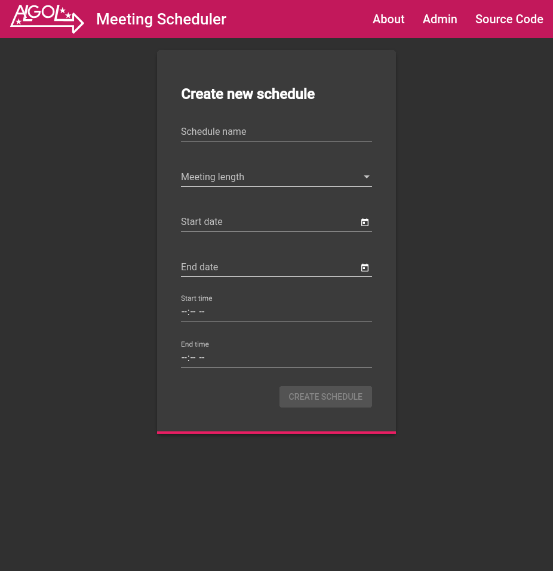
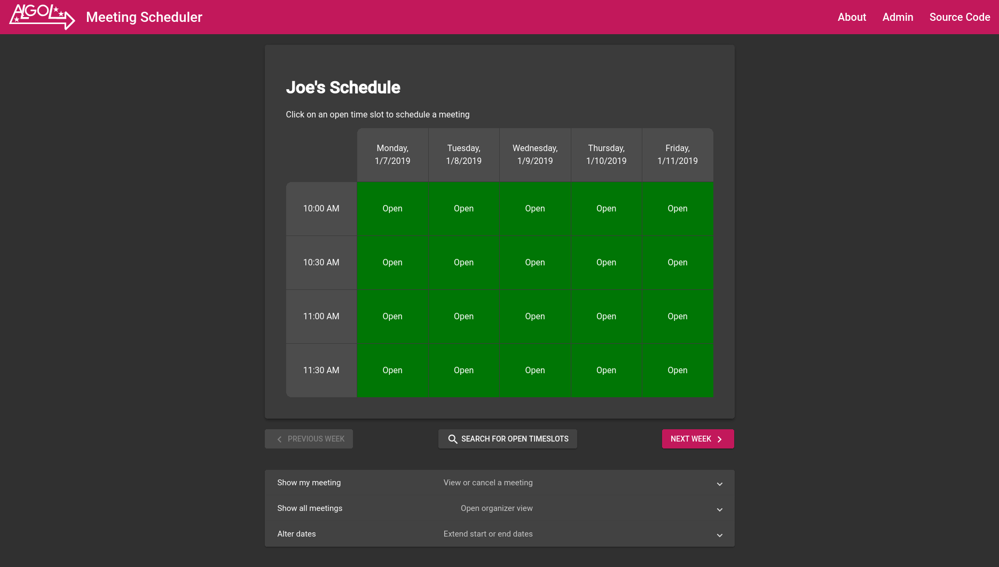
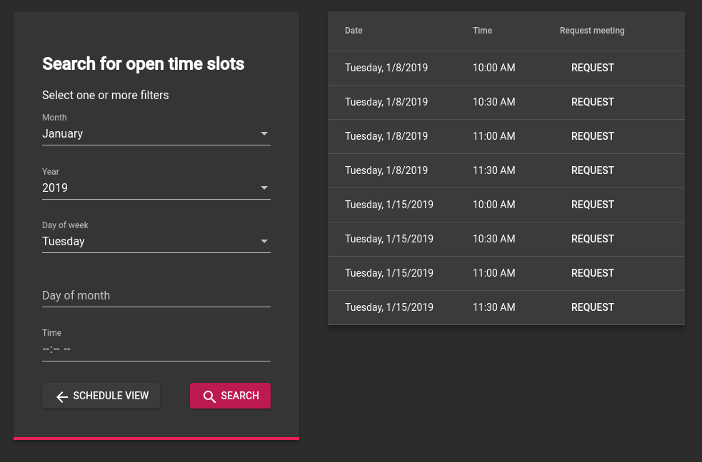

Algol Meeting Scheduler
=======================

[View Website](https://algol.petitti.org)

About
-----

This project was done for CS 3733: Software Engineering. It was
completed by a [team](#team) of four students in about three weeks. The
goal was to create a fully functional web application, including a
public API, HTML/CSS/JavaScript front-end, and MySQL database. We used
Amazon Web Services for the back-end and Angular for the front-end. The
finished project's code can be seen at
[GitHub](https://github.com/jojonium/CS-3733), or it can be seen in
action on [our website](https://algol.petitti.org).

The actual application is designed to allow users to set up a meeting
schedule and send it to others, so that they can request meetings are
particular times with the organizer.

### Organizers

Organizers can specify a starting and ending date for their schedule, as
well as a daily starting time and ending time. They can also select a
preferred meeting length, from ten minutes to an hour. Organizers can
open or close specific time slots, as well as all time slots at a
particular time or on a particular day. If a time slot is closed,
participants can not schedule a meeting for that time.

Once an organizer has created a schedule, she is given a schedule ID and
a secret code. The schedule ID can be given to participants, or shared
as a URL such as `https://cs3733.com/schedule/8bDj38`. The
secret code is for the organizer to use if she wants to edit the
schedule in the future. For example, she could extend the start or end
dates or close particular time slots. The organizer can also use the
secret code to see the names of all participants and when their meetings
are scheduled for.

### Participants

A participant can access a schedule by using its schedule ID. From here,
he can request a meeting on a particular time and date, as long as the
time slot is open and no other participant has requested a meeting at
that same time. Participants are given a secret code when they request a
meeting.

Development
-----------

Our team had one week to plan out the project, including designing the
API using Swagger, drawing up UML diagrams, and writing out use cases.
Then, from November 26 to December 14, 2018 we worked at a feverish pace
to complete the entire project.

### Back-End

The back-end of the project was done in AWS. API requests are processed
by an AWS API gateway, then passed along to a relevant lambda function.
These lambda functions were written in Java using the
Entity-Boundary-Controller design scheme. The lambda functions parse the
incoming JSON data into Java objects, then completes the requested
action. They connect to the database, a MySQL instance running in AWS
RDS, through JDBC.

### Front-End

The front-end was done in Google's Angular framework, using Google's
material design elements and guidelines. Angular applications are
written in TypeScript, a superscript of JavaScript that compiles to
plain JavaScript. The front-end ended up being a miniature
Entity-Boundary-Controller project, with TypeScript object entities,
HTML/CSS boundaries, and TypeScript controllers that make the API calls.

Team
----

The class was divided into groups of four students, and each group was
given a team name based on the names of stars. Since our team was the first to
sign up, we got the "A" star name, Algol.

Joseph Petitti
--------------

Joseph Petitti was the fearless leader of Team Algol. He wrote the
entire front-end in TypeScript for Google's Angular framework, set up
much of the AWS back-end, designed and deployed the API, and spent far
too many late nights debugging and testing.

* [Website](https://josephpetitti.com)

* [GitHub](https://github.com/jojonium)

Justin Cheng
------------

Justin Cheng set up the relational database for the project in AWS,
wrote the database access objects, and wrote and tested several of the
lambda functions. He was our database expert and wrote all the SQL
statements and queries necessary for this web app to work.

* [Website](https://justcheng.com)

* [GitHub](https://github.com/jchengz)

Matthew Hagan
-------------

Matt Hagan was responsible for getting the initial AWS storage,
configurations, and domain set up. As time went on he transitioned to
being the EBC Controller lead for this project, working primarily with
the Lambdas to ensure that the boundary and entity control flow ran
smoothly.

* [Website](http://doublediamond.io)

* [GitHub](https://github.com/subbassbro)

Andrew Levy
-----------

Andrew Levy designed the Algol team logo, as well as some of the HTML of
the early project. He kept us on track by writing weekly progress
reports. He also wrote, tested, and debugged many of the lambda
functions. Also, Andy wanted everyone to know that he has hamsters.

* [Website](http://andrew-levy.com)

* [GitHub](https://github.com/AndrewLevy395)
